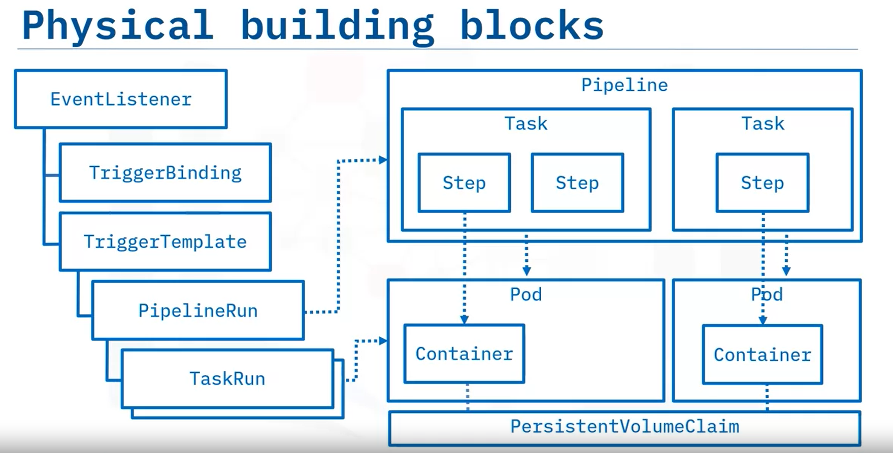

# creating the Basic Tekton Pipeline

## Description,
   * Structuring a __Tekton Pipeline__ project and authoring Tekton Pipeline and tasks so that they are easy to use and parameterize. 
   * Since Tekton allows to reuse __Pipeline-as-a-code__ artifacts, will configure a practical approach to publish the pipeline and task definition to git repository 
  
## Objective,
* Create a base pipeline and task to a echo message
* Apply Parameters to task and pipeline
* Apply additional parameters to a pipeline to clone a github repository

### Tekton Architecture


## Environment-Setup

* Follow the instructions in the main readme for creating k8s cluster, kubectl installation, cluster management tool installation. 
* Navigate to the project directory
```bash
  cd CICD-Automated-Pipelines/Tekton/01. Tekton Base Pipeline
```
* Explore the Project structure
```bash
  ls -l
```

## Agenda 
In true computer programming tradition, the first task you create will echo "Hello World!" to the console.
so we are creating the pipeline for automating this task

## Creating Kuberentes Custom Resource Definition for task and pipeline

### Creating Task (Kubernetes Custom Resource Definition)
* view the ___task.yml___ file in which kube CRD is Created
* apply the ___task.yml___ file to kubectl cluster
```bash
  kubectl apply -f task.yml
```

### Creating Pipeline (Kube CRD)
* view the ___pipeline.yml___ file 
* apply the ___pipeline.yml___ file to kubectl cluster
```bash
  kubectl apply -f pipeline.yml
```
* run the created pipeline in tekton cli
```bash
  tkn pipeline start --show-log <pipeline name>
```
Parameters can be passed when pipeline start with "-p" option followed by parameter name and value
( NOTE: You can list the created pipeline by running 
```bash
  tkn pipeline list
```
)


