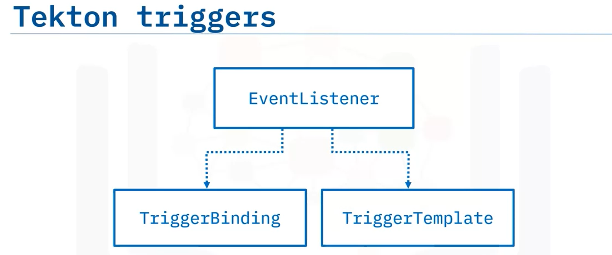
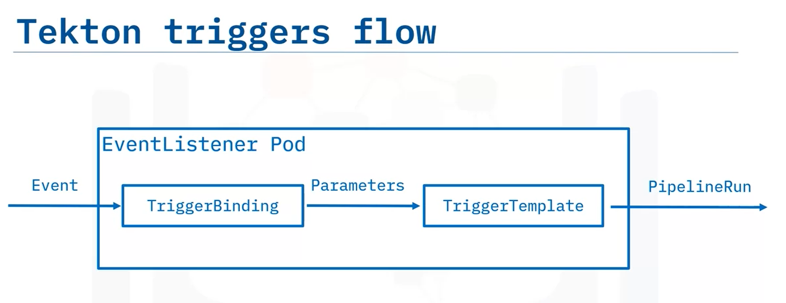

# Tekton trigger

## description,
  running the pipeline based on the external even trigger. Running a pipeline manually has limited uses. in this project we will create a tekton trigger to cause a pipeline run from external events like changes made to the github repo

  ## Objective
  * create an __Event Listener__, __Trigger Binding__, __Trigger Template__ 
  * state how to trigger a deployment when changes are made to github

## pre-requisite
- Event Listener
- Trigger Binding 
- Trigger Template 
- Service Account
- Pipeline Run
- Task Run

### Tekton Triggers


### Tekton Trigger Workflow


___how does Event listener understands the type of event it looks for___

## steps,
  * create the tasks
    ```bash
      kubectl apply -f tasks.yaml
    ```     
  * list the tekton tasks
    ```bash
      tkn task ls
    ```
  * create the tekton pipeline
    ```bash
      kubectl apply -f pipeline.yaml
    ```
  * list the created tekton pipeline
    ```bash
      tkn pipeline list
    ```
  * create Eventlistener
    ```bash
       kubectl apply -f eventlistener.yaml
    ```
  * list the eventlister
    ```bash
      tkn eventlistener list
    ```
  * create the Trigger binding
    ```bash
      kubectl apply -f triggerbinding.yaml
    ```
  * list the created Trigger binding
    ```bash
       tkn triggerbinding list
    ```
  * Create the Trigger Template
    ```bash
       kubectl apply -f triggertemplate.yaml
    ``` 
  * list the created Trigger Template
    ```bash
       tkn triggertemplate list
          #or
       tkn tt ls
    ```

## run the pipeline with event trigger 
* portforward the local host port to the pod
```bash
  kubectl port-forward service/el-cd-eventlistener 8090:8080
```
* use the curl command to run as a specific event so that event listener looks into it
```bash
  curl -X POST http://localhost:8090 <forwarded port> -H 'content-type=application/json' -d '{"ref":"main","repository":{"url":"https://github.com/ibm-developer-skills-network/wtecc-CICD_PracticeCode"}}'
```

This should start a PipelineRun. You can check on the status with this command:
```bash
  tkn pipelinerun ls
```

You can also examine the PipelineRun logs using this command (the -L means "latest" so that you do not have to look up the name for the last run):
```bash
  tkn pipelinerun logs --last
```